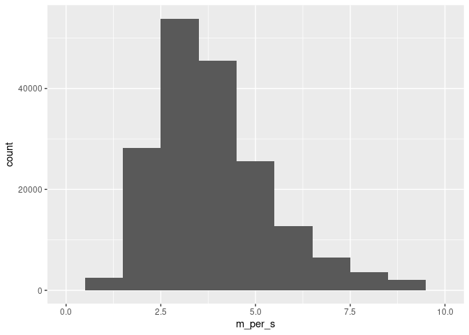
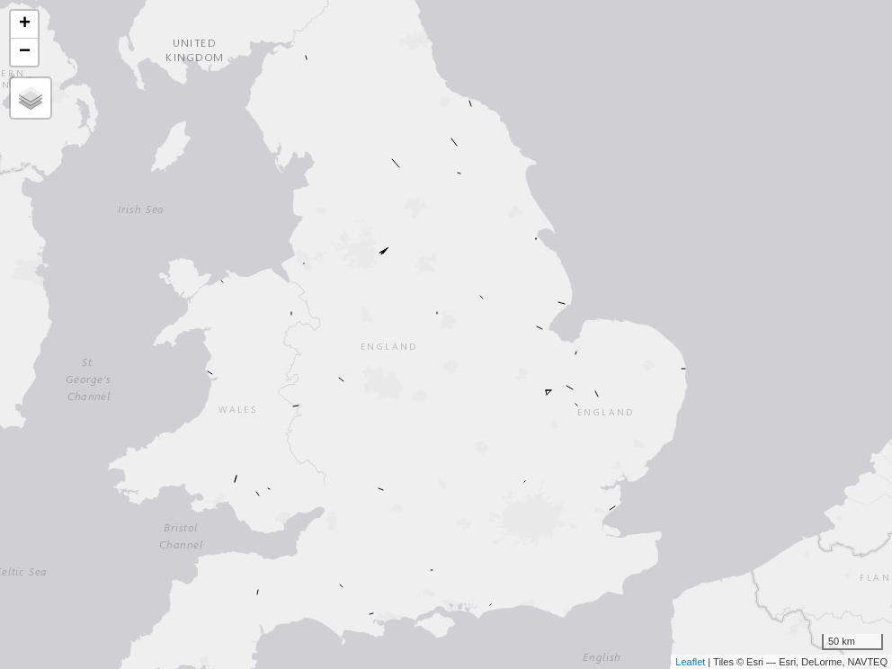

<!-- README.md is generated from README.Rmd. Please edit that file -->

# connectivity-dft-od

<!-- badges: start -->
<!-- badges: end -->

``` r
library(tidyverse)
#> ── Attaching packages ─────────────────────────────────────── tidyverse 1.3.1 ──
#> ✔ ggplot2 3.4.0      ✔ purrr   0.3.5 
#> ✔ tibble  3.1.8      ✔ dplyr   1.0.10
#> ✔ tidyr   1.2.1      ✔ stringr 1.4.1 
#> ✔ readr   2.1.3      ✔ forcats 0.5.2
#> ── Conflicts ────────────────────────────────────────── tidyverse_conflicts() ──
#> ✖ dplyr::filter() masks stats::filter()
#> ✖ dplyr::lag()    masks stats::lag()
library(tmap)
tmap_mode("view")
#> tmap mode set to interactive viewing
remotes::install_cran("arrow")
#> Skipping install of 'arrow' from a cran remote, the SHA1 (10.0.0) has not changed since last install.
#>   Use `force = TRUE` to force installation
urls = readr::read_csv("urls.csv")
#> Rows: 1 Columns: 1
#> ── Column specification ────────────────────────────────────────────────────────
#> Delimiter: ","
#> chr (1): url
#> 
#> ℹ Use `spec()` to retrieve the full column specification for this data.
#> ℹ Specify the column types or set `show_col_types = FALSE` to quiet this message.
u1 = urls$url[1]
# f = basename(u1)
f1 = "car.parquet"
if(!file.exists(f1)) {
  download.file(u1, f1)
}
```

``` r
od_lsoa_cars = arrow::read_parquet(f1, as_data_frame = FALSE)
names(od_lsoa_cars)
#> [1] "origin_lsoa"         "destination_lsoa"    "travel_time_seconds"
#> [4] "__index_level_0__"
od_reduced = od_lsoa_cars %>% 
  filter(travel_time_seconds < 5 * 60) 
od_reduced
#> Table (query)
#> origin_lsoa: string
#> destination_lsoa: string
#> travel_time_seconds: int32
#> __index_level_0__: int64
#> 
#> * Filter: (travel_time_seconds < multiply_checked(5, 60))
#> See $.data for the source Arrow object
```

``` r
od_reduced = collect(od_reduced)
nrow(od_reduced)
#> [1] 271211
```

``` r
lsoas = pct::get_pct(layer = "z", national = TRUE)
#> Warning in CPL_crs_from_input(x): GDAL Message 1: +init=epsg:XXXX syntax is
#> deprecated. It might return a CRS with a non-EPSG compliant axis order.
```

``` r
summary(not_in_od <- !od_reduced$origin_lsoa %in% lsoas$geo_code)
#>    Mode   FALSE    TRUE 
#> logical  184406   86805
sum(not_in_od) / nrow(od_reduced) # 30% of origins not in OD data??
#> [1] 0.3200645
ods_not_in_lsoas = od_reduced[not_in_od, ]
head(ods_not_in_lsoas)
#> # A tibble: 6 × 4
#>   origin_lsoa destination_lsoa travel_time_seconds `__index_level_0__`
#>   <chr>       <chr>                          <int>               <int>
#> 1 S01007184   S01007186                        135            16856741
#> 2 S01007182   S01007186                        219            16856853
#> 3 S01007181   S01007186                        195            16856877
#> 4 S01007185   S01007186                         94            16856945
#> 5 S01007187   S01007186                        204            16857021
#> 6 S01007188   S01007186                        255            16857034
```

``` r
od_sf = od::od_to_sf(x = od_reduced, z = lsoas)
#> 86805 origins with no match in zone ids
#> 86805 destinations with no match in zone ids
#>  points not in od data removed.
od_sf$length_m = as.numeric(sf::st_length(od_sf))
od_sf = od_sf %>% 
  mutate(m_per_s = length_m / travel_time_seconds) %>% 
  mutate(miles_euclidean = length_m / 1000 * 0.62) %>% 
  mutate(time_hours = travel_time_seconds / (60 * 60)) %>% 
  mutate(miles_per_hour_euclidean = miles_euclidean / time_hours)
summary(od_sf)
#>  origin_lsoa        destination_lsoa   travel_time_seconds __index_level_0__ 
#>  Length:184406      Length:184406      Min.   :  7.0       Min.   :     453  
#>  Class :character   Class :character   1st Qu.:197.0       1st Qu.:32467132  
#>  Mode  :character   Mode  :character   Median :239.0       Median :56000530  
#>                                        Mean   :230.2       Mean   :52822081  
#>                                        3rd Qu.:272.0       3rd Qu.:78908625  
#>                                        Max.   :299.0       Max.   :93266090  
#>           geometry         length_m          m_per_s        miles_euclidean  
#>  LINESTRING   :184406   Min.   :  27.75   Min.   : 0.1826   Min.   :0.01721  
#>  epsg:NA      :     0   1st Qu.: 598.56   1st Qu.: 2.8044   1st Qu.:0.37111  
#>  +proj=long...:     0   Median : 830.03   Median : 3.6440   Median :0.51462  
#>                         Mean   : 925.25   Mean   : 4.0631   Mean   :0.57366  
#>                         3rd Qu.:1132.04   3rd Qu.: 4.7554   3rd Qu.:0.70186  
#>                         Max.   :8652.74   Max.   :85.6989   Max.   :5.36470  
#>    time_hours       miles_per_hour_euclidean
#>  Min.   :0.001944   Min.   :  0.4075        
#>  1st Qu.:0.054722   1st Qu.:  6.2594        
#>  Median :0.066389   Median :  8.1334        
#>  Mean   :0.063937   Mean   :  9.0688        
#>  3rd Qu.:0.075556   3rd Qu.: 10.6141        
#>  Max.   :0.083056   Max.   :191.2799
summary(od_sf$miles_per_hour_euclidean)
#>     Min.  1st Qu.   Median     Mean  3rd Qu.     Max. 
#>   0.4075   6.2594   8.1334   9.0688  10.6141 191.2799

od_sf %>% 
  ggplot(aes(m_per_s)) +
  geom_histogram(binwidth = 1) +
  xlim(c(0, 10))
#> Warning: Removed 3313 rows containing non-finite values (`stat_bin()`).
#> Warning: Removed 2 rows containing missing values (`geom_bar()`).
```

<!-- -->

``` r


od_sf %>% 
  ggplot(aes(m_per_s)) +
  geom_histogram(binwidth = 1) +
  xlim(c(0, 10))
#> Warning: Removed 3313 rows containing non-finite values (`stat_bin()`).
#> Removed 2 rows containing missing values (`geom_bar()`).
```

<!-- -->

Get OD pairs that have v. slow average speeds.

``` r
od_sf_fast = od_sf %>% 
  filter(miles_per_hour_euclidean > 60)
m = qtm(od_sf_fast)
```

    #> Interactive map saved to /home/rlatemin/github/robinlovelace/connectivity-dft-od/m1.html

<!-- -->

``` r
lsoas_fast = lsoas %>% 
  filter(geo_code %in% c(od_sf_fast$origin_lsoa, od_sf_fast$destination_lsoa))
```

``` r
m = qtm(od_sf_fast) +
  qtm(lsoas_fast)
```

``` r
oas = sf::read_sf("~/github/modeshift/Output_Areas_(December_2021)_Population_Weighted_Centroids_(Version_2).geojson")
oas_in_msoas = oas[lsoas_fast, ]
m = qtm(od_sf_fast) +
  qtm(lsoas_fast) +
  qtm(oas_in_msoas) 
```

Disaggregation of LSOA OD to OA level OD:

``` r
od_sf_fast$population = 5
od_sf_jittered = odjitter::jitter(od = od_sf_fast, zones = lsoas_fast, subpoints = oas_in_msoas, disaggregation_key = "population", disaggregation_threshold = 2)
m = qtm(od_sf_jittered) +
  qtm(lsoas_fast) +
  qtm(oas_in_msoas)
```
